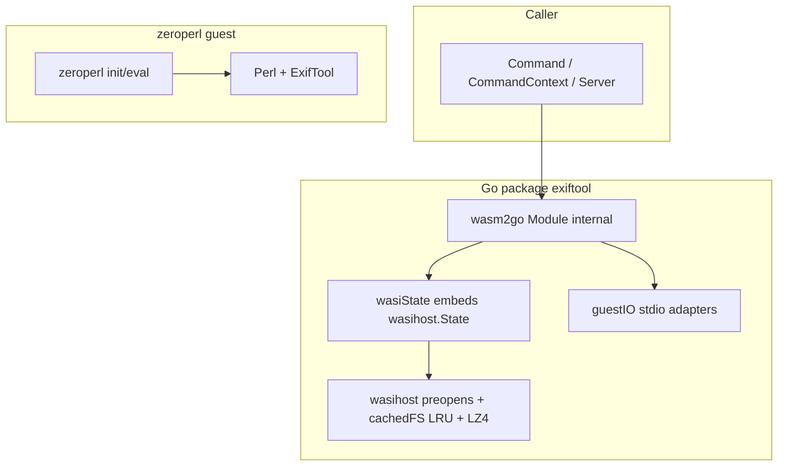

# Architecture: go-exiftool

This document describes the current wasm2go-native architecture: embedded Perl assets, the external
`wasm2go-wasi-host` WASI implementation, and how single-shot APIs differ from Server stay_open mode.

## Goals

- Run ExifTool without os/exec or a host exiftool binary.
- Embed Perl runtime assets and ExifTool script in the module.
- Keep public APIs stable for callers: **Command**, **CommandContext**, **NewServer**, and
  **Server.Command** (plus decode helpers and package vars retained for ncruces compatibility).

## Runtime model

The project does not use a general WASM interpreter at execution time. Instead, zeroperl is emitted
as native Go inside **`internal/zeroperl`** (wasm2go) and invoked directly from package
**`exiftool`**.

## Embedded assets

| Asset                           | Binding          | Role                                                                               |
| ------------------------------- | ---------------- | ---------------------------------------------------------------------------------- |
| embed/perl-wasi-prefix          | go:embed all     | Perl stdlib and wasm32-wasi modules (LZ4-compressed)                               |
| internal/zeroperl               | generated source | Native Go representation of zeroperl guest module (not importable outside module)  |
| github.com/lbe/wasm2go-wasi-host | go module        | WASI snapshot-preview1 host for wasm2go (ModuleConfig, preopens, syscalls) |
| cachefs.go                      | package source   | internal cachedFS wrapper; transparent LZ4 decompression and LRU cache via cfsread |

The ExifTool driver script is loaded from `embed/perl-wasi-prefix/bin/exiftool` inside the embedded
perl-wasi-prefix tree.

At eval time, `exiftoolEvalWrapper` prepends `/lib/perl5` and `/lib/perl5/wasm32-wasi` to `@INC`
(when present in the prefix). The exact tree layout depends on the zeroperl build embedded in
`embed/perl-wasi-prefix`.

## WASI host implementation

WASI is provided by **[github.com/lbe/wasm2go-wasi-host](https://github.com/lbe/wasm2go-wasi-host)** (`wasihost` import).

Integration in this package:

1. **`buildModuleConfig`** returns an immutable `wasihost.ModuleConfig` builder chain: read-only FS
   mounts (`WithReadOnlyFS`), writable host directory preopens (`WithHostDirectoryPreopen`), clocks,
   nanosleep, and `crypto/rand`.
2. **`initWASIState`** adds stdio via `WithStdin` / `WithStdout` / `WithStderr`, then constructs
   `wasihost.New(func() []byte { return *mod.Xmemory().Slice() }, moduleCfg)`. The memory callback is
   re-invoked on every syscall so guest memory growth stays valid.
3. **`wasiState`** embeds `*wasihost.State` and is passed to `wasm2go.New(ws, ws)` as both import
   handlers. It overrides `Xproc_exit` to panic with `exitPanic{code}` instead of `wasihost.ExitError`
   so eval boundaries recover exit codes uniformly.

Each zeroperl module instance has its own `wasihost.State` (not concurrent-safe across goroutines).

`proc_exit` panics are recovered at eval boundaries (`evalModule`, Server eval goroutine, `initModule`).

## Filesystem/mount model

`buildModuleConfig` in `exiftool.go` assembles the mount layout from a
`wasihost.NewModuleConfig()` builder chain:

- `/host` (`hostWorkDir`) is the **primary writable host directory preopen** for the caller's working
  directory so ExifTool can read and write files there. The guest cwd is set to `/host` via Perl
  preamble `chdir` so relative paths resolve there instead of aliasing the read-only `/lib` and
  `/bin` mount prefixes.
- **Host cwd path aliases**: the host cwd is also preopened at its guest absolute path (via
  `registerHostDirPreopenAliases`) so host-absolute file arguments remain reachable (for example
  `/var` vs `/private/var` on macOS).
- `/lib` is a **read-only FS** (`moduleCfg.WithReadOnlyFS("/lib", fs.Sub(perlFS(), "lib"))`) serving
  the embedded Perl standard library.
- `/bin` is a **read-only FS** (`moduleCfg.WithReadOnlyFS("/bin", fs.Sub(perlFS(), "bin"))`) serving
  the ExifTool script at `/bin/exiftool`.
- `/dev` is a read-only FS backed by `devNullFS`.
- **`os.TempDir()` and operand parent directories** from [commandWritableDirs] are preopened via
  `registerHostDirPreopenAliases` as **writable** host mounts. Command rewrites file operands (and
  path-valued flags such as `-config`) to host-absolute paths. Operand preopens widen writable host
  access to parent directories of those paths; callers should not pass unintended paths as operands.
- An optional `/work` read-only FS can be supplied.

Separate preopens for `/host`, `/lib`, and `/bin` keep embedded assets and the writable working
directory isolated, matching the `wasm2go-wasi-host` mount model.

`perlFS()` returns a process-level internal cachedFS singleton (initialized once via `sync.Once`)
backed by a `cfsread.Reader` with LZ4 magic-byte decompression and a 2000-entry LRU cache. The
`embed/perl-wasi-prefix` tree is stored LZ4-compressed in the binary; files are decompressed on
first access and subsequent reads are served from the in-memory cache with zero allocations.

## I/O model

Internal **guestIO** abstracts stdin/stdout/stderr for both execution modes:

- **directIO** buffers stdin/stdout/stderr for single-shot Command paths.
- **serverIO** (pipe-backed): used by Server to preserve stream semantics and framing behavior.

## Execution flows

Single-shot (**Command** / **CommandContext**):

1. Resolve cwd; build writable preopens via [commandWritableDirs] (temp + [operandPreopenDirs]).
2. `newModule`: `wasm2go.New(wasiState, wasiState)`, `initWASIState` + `buildModuleConfig`, `X_initialize`.
3. Rewrite file operands to host-absolute paths ([absolutizeOperands]), then `evalModule`.
4. Recover `exitPanic` from `proc_exit`; exit code 0 returns stdout; -json per-file Error yields [ExitError] code 1.

Server stay_open:

1. Start one long-lived module and run zeroperl_eval with stay_open args.
2. Send commands through stdin with -execute boundary framing.
3. Parse output frames with splitReadyToken.
4. Shutdown/restart via stay_open false and controlled stop/finalize.

## Concurrency and lifecycle

- cmdMtx serializes Server.Command calls.
- srvMtx protects lifecycle state and restart/close sequencing.
- restartErr captures deferred startup failure reporting.
- `Server.Shutdown` sends `-stay_open false`, closes stdin, and waits for the eval
  goroutine (`<-evalDone`). Safe only after Perl is in the stay_open read loop; during
  init (module load) it can block indefinitely because `Xzeroperl_eval` is synchronous.
- `Server.Close` force-closes stdin/stdout pipes via `stopForceClose` and does not wait
  for the eval goroutine. Use when shutdown must not hang (e.g. Perl still initializing).

## Relevant files

| File               | Responsibility                                                 |
| ------------------ | -------------------------------------------------------------- |
| init.go            | package documentation, compatibility vars (Exec, Arg1, Config) |
| exiftool.go        | module setup, buildModuleConfig, eval path                     |
| operand_preopen.go | operand path resolution and Command writable preopen dirs    |
| wasi.go            | wasiState wrapper overriding Xproc_exit                        |
| io.go              | guestIO implementations                                        |
| cmd.go             | Command and CommandContext                                     |
| server.go          | stay_open server process model                                 |
| decode.go          | Unmarshal helper for line-oriented ExifTool text output        |
| cachefs.go         | internal cachedFS wrapper, cfsread integration                 |

## Related references

- README.md for usage and embed refresh process.
- TESTING.md for build tags, local commands, and CI.
