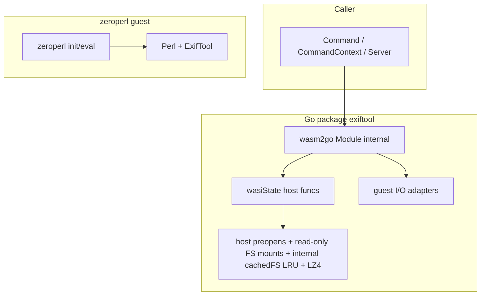

# Architecture: go-exiftool

This document describes the current wasm2go-native architecture: embedded Perl assets, the external
`wasm2go-wasi-host` WASI implementation, and how single-shot APIs differ from Server stay_open mode.

## Goals

- Run ExifTool without os/exec or a host exiftool binary.
- Embed Perl runtime assets and ExifTool script in the module.
- Keep public APIs stable for callers: **Command**, **CommandContext**, **NewServer**, and
  **Server.Command** (plus decode helpers and package vars retained for ncruces compatibility).

## Runtime model

The project does not use a general WASM interpreter at execution time. Instead, zeroperl is emitted
as native Go inside **`internal/zeroperl`** (wasm2go) and invoked directly from package
**`exiftool`**.

## Embedded assets

| Asset                           | Binding          | Role                                                                               |
| ------------------------------- | ---------------- | ---------------------------------------------------------------------------------- |
| embed/perl-wasi-prefix          | go:embed all     | Perl stdlib and wasm32-wasi modules (LZ4-compressed)                               |
| internal/zeroperl               | generated source | Native Go representation of zeroperl guest module (not importable outside module)  |
| github.com/lbe/wasm2go-wasi-host | go module        | External WASI host implementation replacing the former internal wasi-wasm2go module |
| cachefs.go                      | package source   | internal cachedFS wrapper; transparent LZ4 decompression and LRU cache via cfsread |

The ExifTool driver script is loaded from `embed/perl-wasi-prefix/bin/exiftool` inside the embedded
perl-wasi-prefix tree.

The guest environment includes PERL5LIB=/lib/5.16.3:/lib/5.16.3/wasm32-wasi.

## WASI host implementation

The WASI host is provided by the external module **github.com/lbe/wasm2go-wasi-host**. Package
`exiftool` wraps it in `wasiState` (defined in `wasi.go`) which overrides `Xproc_exit` to panic with
`exitPanic{code}` instead of the host's default `ExitError`, allowing eval boundaries to recover it.

Key behaviors:

- Dynamic memory access via `module.Xmemory().Slice()` on each call (avoids stale slice after memory
  growth).
- Mounts are configured via `wasihost.Option` values passed to `wasihost.New`.
- proc_exit is modeled via `panic(exitPanic{code})` and recovered at eval boundaries.

## Filesystem/mount model

Mounts are configured per module instantiation using `wasihost.Option` values:

- `/` is a **writable host directory preopen** (`wasihost.WithHostDirectoryPreopen("/", cwd)`) so
  ExifTool can read and write files in the caller's working directory.
- `/lib` is a **read-only FS** (`wasihost.WithReadOnlyFS("/lib", fs.Sub(perlFS(), "lib"))`) serving
  the embedded Perl standard library.
- `/bin` is a **read-only FS** (`wasihost.WithReadOnlyFS("/bin", fs.Sub(perlFS(), "bin"))`) serving
  the ExifTool script at `/bin/exiftool`.
- `/dev` is a read-only FS backed by `devNullFS`.
- Additional writable host directories (e.g. `os.TempDir()`) are mounted via
  `wasihost.WithHostDirectoryPreopen(dir, dir)`.
- An optional `/work` read-only FS can be supplied.

This replaces the former `overlayFS` + `defaultRootFS()` approach, which layered the embedded Perl
stdlib over the host working directory in a single mount. The new approach uses separate mounts for
each concern, matching the `wasm2go-wasi-host` preopen model.

`perlFS()` returns a process-level internal cachedFS singleton (initialized once via `sync.Once`)
backed by a `cfsread.Reader` with LZ4 magic-byte decompression and a 2000-entry LRU cache. The
`embed/perl-wasi-prefix` tree is stored LZ4-compressed in the binary; files are decompressed on
first access and subsequent reads are served from the in-memory cache with zero allocations.

## I/O model

Internal **guestIO** abstracts stdin/stdout/stderr for both execution modes:

- **directIO** buffers stdin/stdout/stderr for single-shot Command paths.
- **serverIO** (pipe-backed): used by Server to preserve stream semantics and framing behavior.

## Execution flows

Single-shot (**Command** / **CommandContext**):

1. Build module + wasiState + mounts.
2. Call zeroperl_init (inside evalModule path).
3. Allocate script and argv in guest memory.
4. Call zeroperl_eval.
5. Recover proc_exit; exit code 0 is success and preserves stdout.

Server stay_open:

1. Start one long-lived module and run zeroperl_eval with stay_open args.
2. Send commands through stdin with -execute boundary framing.
3. Parse output frames with splitReadyToken.
4. Shutdown/restart via stay_open false and controlled stop/finalize.

## Concurrency and lifecycle

- cmdMtx serializes Server.Command calls.
- srvMtx protects lifecycle state and restart/close sequencing.
- restartErr captures deferred startup failure reporting.
- stop/close paths bound wait times to avoid indefinite hangs.

## Relevant files

| File        | Responsibility                                 |
| ----------- | ---------------------------------------------- |
| exiftool.go | module setup, eval path                        |
| wasi.go     | wasiState wrapper overriding Xproc_exit        |
| io.go       | guestIO implementations                        |
| cmd.go      | Command and CommandContext                     |
| server.go   | stay_open server process model                 |
| cachefs.go  | internal cachedFS wrapper, cfsread integration |

## Related references

- README.md for usage and embed refresh process.
- docs/superpowers/plans/2026-04-04-wasm2go-wrapper.md for migration plan context.
