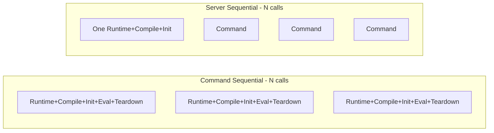

# Benchmark Design: go-exiftool Operational Modes

## Operational Modes Identified

The library has **three distinct operational modes** that need benchmarking:

| Mode | Entry Point | Runtime Lifecycle | WASM Compile | Module Lifecycle |
|------|-------------|-------------------|--------------|------------------|
| **Command** | [`Command()`](cmd.go:18) / [`CommandContext()`](cmd.go:28) | New per call | New per call | New per call |
| **Run** | [`Run()`](exiftool.go:293) / [`RunDebug()`](exiftool.go:321) | New per call | New per call | New per call |
| **Server** | [`NewServer()`](server.go:71) + [`Server.Command()`](server.go:340) | One shared | One shared | One shared, stay_open |

### Key Differences

- **Command**: Uses [`defaultRootFS()`](exiftool.go:115) — overlay of embedded Perl + host CWD. Has writable temp dir. Accepts optional stdin (`io.Reader`).
- **Run**: Uses [`perlFS()`](exiftool.go:103) only + optional `workFS` at `/work`. No writable temp dir by default.
- **Server**: Uses `defaultRootFS()` with writable temp. Keeps one WASM module alive via `-stay_open` protocol. Does **not** accept stdin per command — stdin is occupied by the stay_open protocol.

### stdin Constraints

- **Command**: Can pipe image bytestreams via stdin using `-` as filename: `Command(bytes.NewReader(img), "-json", "-")`
- **Server**: Cannot use stdin for image data — stdin is multiplexed for stay_open command protocol. Workaround: write bytes to a temp file, then pass the path.
- **Run**: No stdin parameter in the API; files must be in `workFS`.

## Benchmark Categories

### 1. Cold Start Benchmarks

Measure the full lifecycle of a single invocation — runtime creation, WASM compilation, module instantiation, Perl init, ExifTool execution, and teardown.

| Benchmark | What it measures |
|-----------|-----------------|
| `BenchmarkCommand_Version` | Full `Command(nil, "-ver")` cycle — no file I/O |
| `BenchmarkRun_Version` | Full `Run(ctx, workFS, "-ver")` cycle — no file I/O |
| `BenchmarkNewServer` | `NewServer()` startup only — runtime + compile + instantiate + stay_open handshake |

### 2. Warm Operation Benchmarks — Server only

Measure per-command cost **after** the server is already started. The server is created outside the `b.N` loop so only `Server.Command()` is timed.

| Benchmark | What it measures |
|-----------|-----------------|
| `BenchmarkServerCommand_Version` | Single `Server.Command("-ver")` — warm, no file I/O |
| `BenchmarkServerCommand_ReadTags` | Single `Server.Command("-Artist", "-Copyright", "testdata/sample.jpg")` |
| `BenchmarkServerCommand_AllTags` | Single `Server.Command("testdata/sample.jpg")` — full metadata extraction |
| `BenchmarkServerCommand_JSON` | Single `Server.Command("-json", "testdata/sample.jpg")` — JSON output |
| `BenchmarkServerCommand_MultipleFiles` | Single `Server.Command("-FileName", "-Artist", "testdata/sample.jpg", "testdata/sample_gps.jpg")` |

### 3. File Reading Benchmarks — Single-shot

Measure single-shot file reading through both `Command` and `Run`.

| Benchmark | What it measures |
|-----------|-----------------|
| `BenchmarkCommand_ReadTags` | `Command(nil, "-Artist", "-Copyright", "testdata/sample.jpg")` |
| `BenchmarkCommand_AllTags` | `Command(nil, "testdata/sample.jpg")` |
| `BenchmarkCommand_JSON` | `Command(nil, "-json", "testdata/sample.jpg")` |
| `BenchmarkRun_ReadTags` | `Run(ctx, workFS, "-Artist", "-Copyright", "/work/test.jpg")` |
| `BenchmarkRun_AllTags` | `Run(ctx, workFS, "/work/test.jpg")` |
| `BenchmarkRun_JSON` | `Run(ctx, workFS, "-json", "/work/test.jpg")` |

### 4. stdin Image Stream Benchmarks — Critical Pattern

These benchmarks measure the pattern where image bytes are piped via stdin instead of reading from the filesystem. This is only available in `Command` mode.

For `Server` mode, the benchmark measures the workaround: writing image bytes to a temp file, then passing the path.

| Benchmark | What it measures |
|-----------|-----------------|
| `BenchmarkCommand_StdinImage` | `Command(bytes.NewReader(imgBytes), "-json", "-")` — image via stdin, no filesystem |
| `BenchmarkCommand_StdinImage_Tags` | `Command(bytes.NewReader(imgBytes), "-Artist", "-Copyright", "-")` — selective tags via stdin |
| `BenchmarkServer_TempFileImage` | Write imgBytes to temp file + `Server.Command("-json", tempPath)` — Server workaround for in-memory images |

The stdin pattern is critical because:
- It avoids needing the file on the virtual filesystem visible to the WASM sandbox
- It measures the overhead of piping binary data through WASI stdin vs. letting ExifTool read via WASI filesystem
- It quantifies the Server-mode penalty of the temp-file workaround

### 5. Throughput Comparison Benchmarks

Run N sequential operations to show the amortization benefit of the Server mode.

| Benchmark | What it measures |
|-----------|-----------------|
| `BenchmarkCommand_SequentialVersion` | N × `Command(nil, "-ver")` — each creates/destroys runtime |
| `BenchmarkServer_SequentialVersion` | N × `Server.Command("-ver")` — one server, N commands |
| `BenchmarkCommand_SequentialRead` | N × `Command(nil, "-Artist", "testdata/sample.jpg")` |
| `BenchmarkServer_SequentialRead` | N × `Server.Command("-Artist", "testdata/sample.jpg")` |



### 6. File Size / Type Variation

Use different test fixtures to measure how file characteristics affect performance. All use warm Server commands.

| Benchmark | File | Size |
|-----------|------|------|
| `BenchmarkServerCommand_SmallJPG` | `testdata/base.jpg` | ~203 B |
| `BenchmarkServerCommand_MediumJPG` | `testdata/sample.jpg` | ~3.5 KB |
| `BenchmarkServerCommand_LargeJPG` | `testdata/test.jpg` | ~133 KB |
| `BenchmarkServerCommand_PNG` | `testdata/sample.png` | ~284 B |
| `BenchmarkServerCommand_TIFF` | `testdata/sample.tiff` | ~60 KB |

## Benchmark File Structure

```
bench_test.go
│
├── Cold Start
│   ├── BenchmarkCommand_Version
│   ├── BenchmarkRun_Version
│   └── BenchmarkNewServer
│
├── Warm Server Operations
│   ├── BenchmarkServerCommand_Version
│   ├── BenchmarkServerCommand_ReadTags
│   ├── BenchmarkServerCommand_AllTags
│   ├── BenchmarkServerCommand_JSON
│   └── BenchmarkServerCommand_MultipleFiles
│
├── Single-shot File Reading
│   ├── BenchmarkCommand_ReadTags
│   ├── BenchmarkCommand_AllTags
│   ├── BenchmarkCommand_JSON
│   ├── BenchmarkRun_ReadTags
│   ├── BenchmarkRun_AllTags
│   └── BenchmarkRun_JSON
│
├── stdin Image Stream
│   ├── BenchmarkCommand_StdinImage
│   ├── BenchmarkCommand_StdinImage_Tags
│   └── BenchmarkServer_TempFileImage
│
├── Throughput Comparison
│   ├── BenchmarkCommand_SequentialVersion
│   ├── BenchmarkServer_SequentialVersion
│   ├── BenchmarkCommand_SequentialRead
│   └── BenchmarkServer_SequentialRead
│
└── File Size / Type Variation
    ├── BenchmarkServerCommand_SmallJPG
    ├── BenchmarkServerCommand_MediumJPG
    ├── BenchmarkServerCommand_LargeJPG
    ├── BenchmarkServerCommand_PNG
    └── BenchmarkServerCommand_TIFF
```

## Design Patterns

### Server warm benchmark pattern

Server created **once** outside timing, `Server.Command()` inside `b.N` loop:

```go
func BenchmarkServerCommand_Version(b *testing.B) {
    e, err := NewServer()
    if err != nil { b.Fatal(err) }
    defer e.Shutdown()

    b.ResetTimer()
    for i := 0; i < b.N; i++ {
        if _, err := e.Command("-ver"); err != nil {
            b.Fatal(err)
        }
    }
}
```

### Cold-start benchmark pattern

Full lifecycle inside `b.N` loop — each iteration pays full cost:

```go
func BenchmarkCommand_Version(b *testing.B) {
    b.ResetTimer()
    for i := 0; i < b.N; i++ {
        if _, err := Command(nil, "-ver"); err != nil {
            b.Fatal(err)
        }
    }
}
```

### stdin image benchmark pattern

Image bytes loaded once, fresh `bytes.Reader` per iteration:

```go
func BenchmarkCommand_StdinImage(b *testing.B) {
    imgBytes, err := os.ReadFile("testdata/sample.jpg")
    if err != nil { b.Fatal(err) }

    b.ResetTimer()
    for i := 0; i < b.N; i++ {
        if _, err := Command(bytes.NewReader(imgBytes), "-json", "-"); err != nil {
            b.Fatal(err)
        }
    }
}
```

### Server temp-file workaround pattern

Measures the full cost of materializing in-memory image data for Server consumption:

```go
func BenchmarkServer_TempFileImage(b *testing.B) {
    imgBytes, err := os.ReadFile("testdata/sample.jpg")
    if err != nil { b.Fatal(err) }

    e, err := NewServer()
    if err != nil { b.Fatal(err) }
    defer e.Shutdown()

    b.ResetTimer()
    for i := 0; i < b.N; i++ {
        tmp, err := os.CreateTemp("", "bench-*.jpg")
        if err != nil { b.Fatal(err) }
        if _, err := tmp.Write(imgBytes); err != nil { b.Fatal(err) }
        tmp.Close()
        _, err = e.Command("-json", tmp.Name())
        os.Remove(tmp.Name())
        if err != nil { b.Fatal(err) }
    }
}
```

### Run benchmark pattern

`workFS` created once outside loop:

```go
func BenchmarkRun_Version(b *testing.B) {
    ctx := context.Background()
    workFS := os.DirFS("testdata")

    b.ResetTimer()
    for i := 0; i < b.N; i++ {
        if _, err := Run(ctx, workFS, "-ver"); err != nil {
            b.Fatal(err)
        }
    }
}
```

## Running the Benchmarks

```bash
# All benchmarks — allow ample time due to ~7-10s cold starts
go test -bench=. -benchtime=3x -timeout=30m -run=^$

# Only server warm benchmarks — fast
go test -bench=BenchmarkServerCommand -timeout=10m -run=^$

# Only stdin image benchmarks
go test -bench="Stdin|TempFile" -timeout=30m -run=^$

# Only cold-start benchmarks — slow
go test -bench="Benchmark(Command|Run)_Version" -timeout=30m -run=^$

# Compare results between versions using benchstat
go test -bench=. -count=5 -timeout=60m -run=^$ | tee old.txt
# ... make changes ...
go test -bench=. -count=5 -timeout=60m -run=^$ | tee new.txt
benchstat old.txt new.txt

# With memory profiling
go test -bench=BenchmarkServerCommand_Version -benchmem -run=^$
```

## Expected Insights

1. **Cold start dominates**: `Command` and `Run` will show ~7-10s per operation due to WASM compile + Perl init
2. **Server amortization**: `Server.Command` warm calls should be orders of magnitude faster since runtime is reused
3. **stdin vs filesystem**: stdin image passing avoids filesystem overhead but still pays cold-start cost; comparing `BenchmarkCommand_StdinImage` vs `BenchmarkCommand_JSON` reveals the I/O vs compute split
4. **Server temp-file penalty**: `BenchmarkServer_TempFileImage` vs `BenchmarkServerCommand_JSON` shows the overhead of materializing in-memory images for Server consumption
5. **Command vs Run overhead**: `Command` uses `defaultRootFS()` overlay with host CWD while `Run` uses `perlFS()` only — the overlay may add marginal lookup overhead
6. **File size correlation**: Larger files with more metadata take longer to parse, but the difference is small relative to cold start
7. **Sequential throughput**: The sequential benchmarks clearly show N×cold-start vs 1×cold-start + N×warm-command

## Notes on mmap Feasibility

wazero's [`FSConfig.WithFSMount()`](exiftool.go:166) accepts Go's `fs.FS` interface. WASI `fd_read` syscalls copy data from host buffers into WASM linear memory — there is no mechanism to directly map host memory pages into the WASM address space. A custom `fs.FS` backed by `syscall.Mmap` `[]byte` would avoid host `read()` syscalls, but the copy into WASM memory still occurs via WASI. The practical benefit would be marginal since the dominant cost is WASM initialization, not host file I/O. This is not included as a benchmark category.
